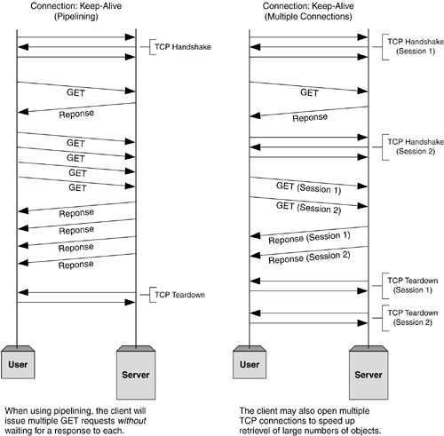

## HTTP/1.1

* Introduced critical performance optimizations and feature enhancements — persistent and pipelined connections, chunked transfers, compression/decompression, content negotiations, virtual hosting (a server with a single IP Address hosting multiple domains), faster response and great bandwidth savings by adding cache support.
* Methods supported: 1.0 + PUT, DELETE, TRACE, OPTIONS
* Connection nature: long-lived


```
(Connection 1 Establishment - TCP Three-Way Handshake)
Connected to xxx.xxx.xxx.xxx

(Request 1)
GET /en-US/docs/Glossary/Simple_header HTTP/1.1
Host: developer.mozilla.org
User-Agent: Mozilla/5.0 (Macintosh; Intel Mac OS X 10.9; rv:50.0) Gecko/20100101 Firefox/50.0
Accept: text/html,application/xhtml+xml,application/xml;q=0.9,*/*;q=0.8
Accept-Language: en-US,en;q=0.5
Accept-Encoding: gzip, deflate, br
Referer: https://developer.mozilla.org/en-US/docs/Glossary/Simple_header

(Response 1)
HTTP/1.1 200 OK
Connection: Keep-Alive
Content-Encoding: gzip
Content-Type: text/html; charset=utf-8
Date: Wed, 20 Jul 2016 10:55:30 GMT
Etag: "547fa7e369ef56031dd3bff2ace9fc0832eb251a"
Keep-Alive: timeout=5, max=1000
Last-Modified: Tue, 19 Jul 2016 00:59:33 GMT
Server: Apache
Transfer-Encoding: chunked
Vary: Cookie, Accept-Encoding

[content]

(Request 2)
GET /static/img/header-background.png HTTP/1.1
Host: developer.cdn.mozilla.net
User-Agent: Mozilla/5.0 (Macintosh; Intel Mac OS X 10.9; rv:50.0) Gecko/20100101 Firefox/50.0
Accept: */*
Accept-Language: en-US,en;q=0.5
Accept-Encoding: gzip, deflate, br
Referer: https://developer.mozilla.org/en-US/docs/Glossary/Simple_header

(Response 2)
HTTP/1.1 200 OK
Age: 9578461
Cache-Control: public, max-age=315360000
Connection: keep-alive
Content-Length: 3077
Content-Type: image/png
Date: Thu, 31 Mar 2016 13:34:46 GMT
Last-Modified: Wed, 21 Oct 2015 18:27:50 GMT
Server: Apache

[image content of 3077 bytes]

(Connection 1 Closed - TCP Teardown)
```

* HTTP pipelining, multiple connections, and many more improvements have been implemented, thanks to the Keep-Alive header’s behavior.



<a href="./slide7.md"></a>
<a href="./slide9.md"></a>
